# Examples gallery

Each example is a self-contained script in [examples/](../examples/).
Run any of them from the repo root:

```bash
python examples/<script_name>.py
```

Output images are saved to [output/](../output/).

---

## 1. Quick plot from a DataFrame

**Source:** [examples/ex_quickplot.py](../examples/ex_quickplot.py)

`plot_signals()` one-liner that accepts a DataFrame and a group spec.
Three call styles are shown: auto-detect, single-signal subplots, and
explicit dict config.

**Auto-detect** (0/1 columns → digital, others → analog):

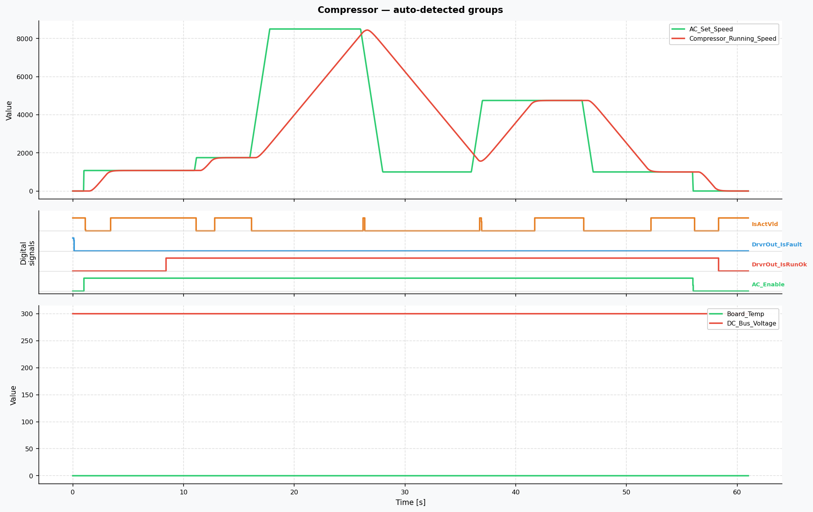

**Explicit group config** with ylabel overrides:

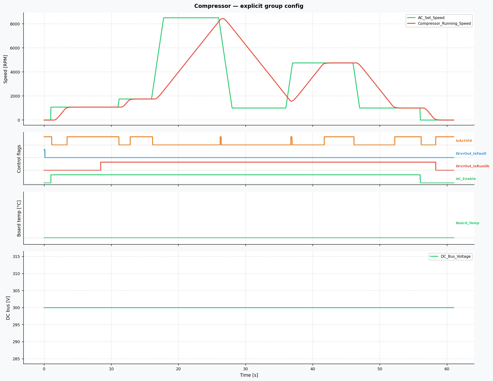

---

## 2. Quick plot from YAML

**Source:** [examples/ex_quickplot_from_yaml.py](../examples/ex_quickplot_from_yaml.py)

`plot_signals_from_yaml()` loads signal lists and visual presets from a
YAML file — useful for standardised report views shared across projects.

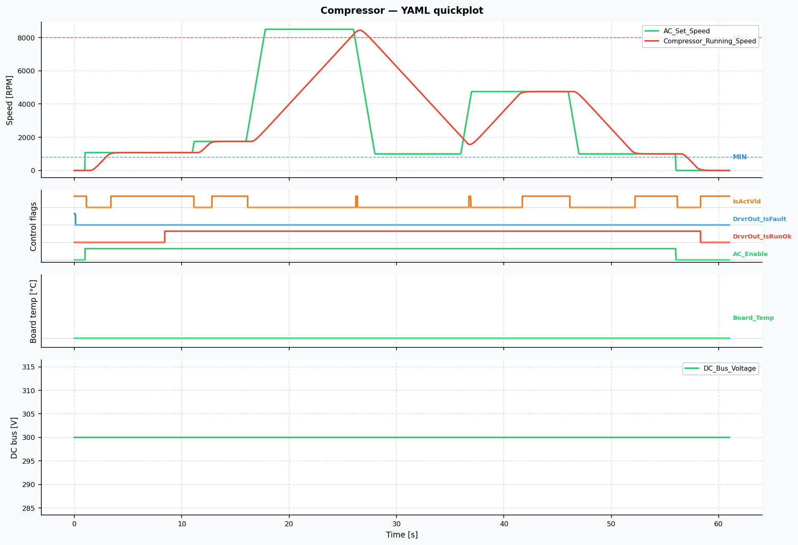

---

## 3. Pure Python API

**Source:** [examples/ex_plot_from_script.py](../examples/ex_plot_from_script.py)

Multi-group diagram built entirely from the Python API: stepped command,
first-order lag response, tolerance band, threshold lines, digital lanes,
phase labels, and VSpan / VLine annotations.

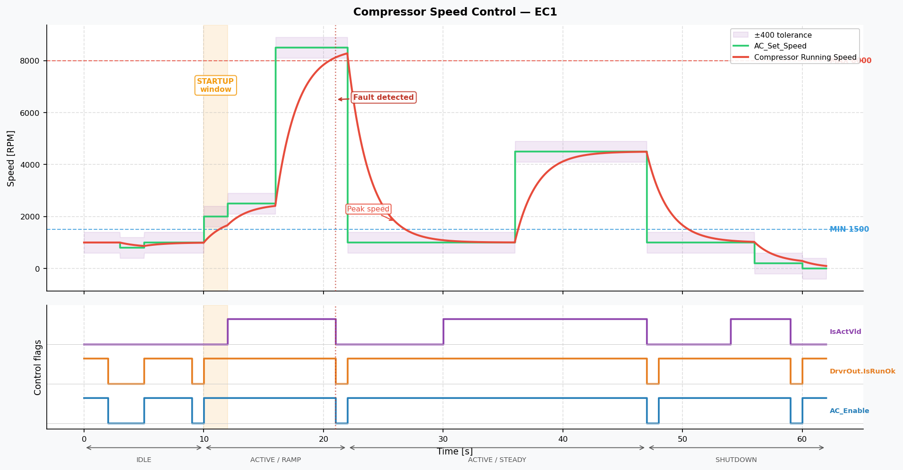

---

## 4. Measured signals from CSV / DataFrame

**Source:** [examples/ex_plot_from_csv.py](../examples/ex_plot_from_csv.py)

`add_measured()` and `add_measured_digital()` load columns directly from
a pandas DataFrame. Works identically with CSV, Parquet, SQL, or any other
pandas-compatible source.

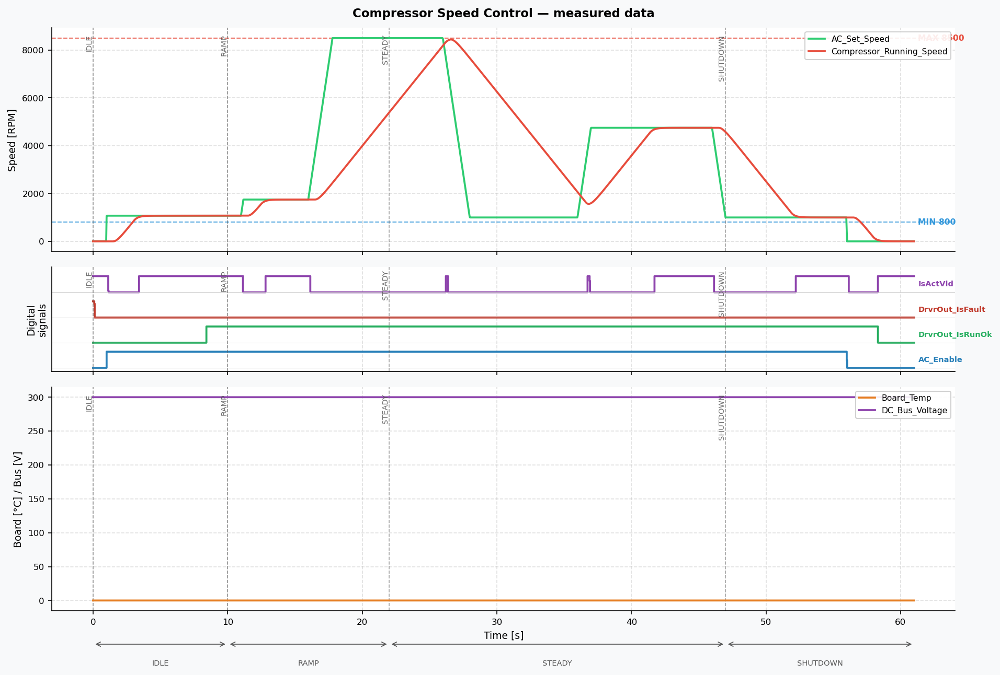

---

## 5. Transient analysis — synthetic signals

**Source:** [examples/ex_plot_control_transient.py](../examples/ex_plot_control_transient.py)

`add_transient_analysis()` draws a ±tolerance% band, MATLAB-style cross-hair
lines, settling time `Ts`, rise time `Tr`, and overshoot `OS%` callout.

**Single step:**

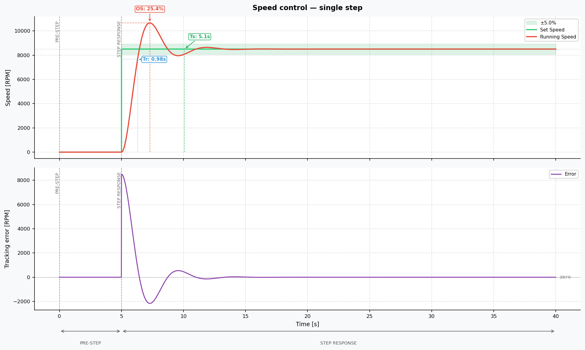

**Multi-step trace** — each step analysed in its own window:

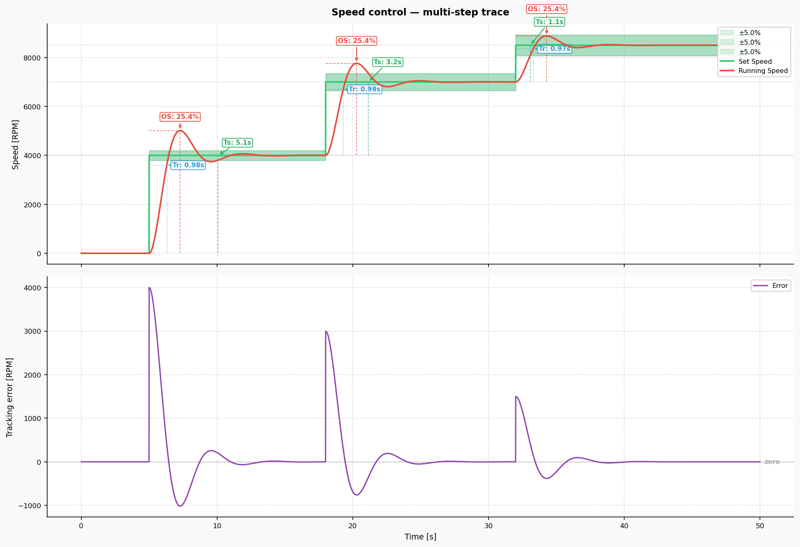

---

## 6. Transient analysis — measured CSV data (explicit windows)

**Source:** [examples/ex_plot_csv_analysis.py](../examples/ex_plot_csv_analysis.py)

Same analysis applied to a real simulation CSV with two step events.
`after_t` / `before_t` isolate each flat-setpoint window explicitly.

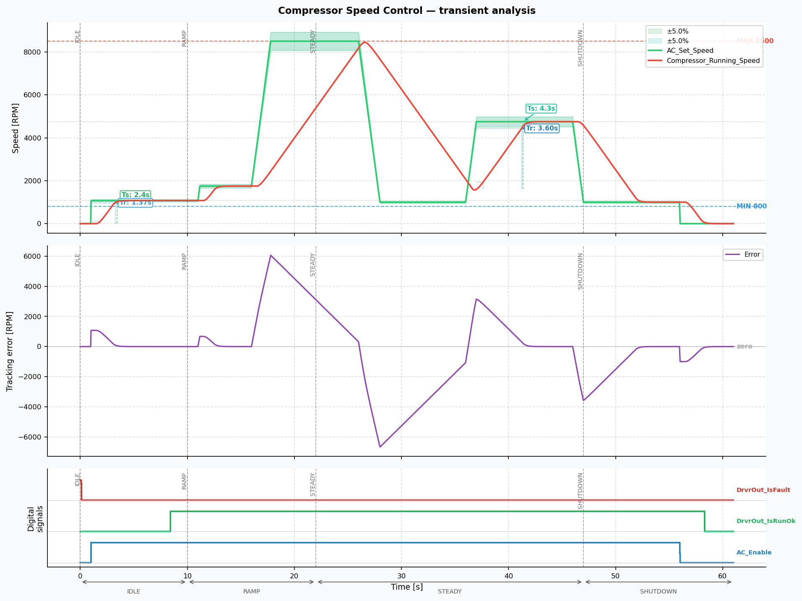

---

## 7. Phase-first workflow + event-duration annotation

**Source:** [examples/ex_plot_csv_analysis_sim.py](../examples/ex_plot_csv_analysis_sim.py)

`add_phase()` returns `PhaseLabel` objects that are passed directly to
`add_transient_analysis()` — no repeated coordinates.

`add_event_duration()` measures and annotates the elapsed time between two
events from different groups: here, the moment the tracking error drops
below 100 RPM → the moment `DrvrOut_IsRunOk` goes HIGH.

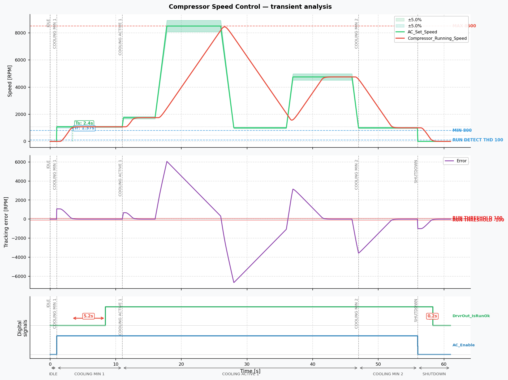

---

## 8. Load from YAML — synthetic + real log

**Source:** [examples/ex_plot_from_yaml.py](../examples/ex_plot_from_yaml.py)  
**Config:** [examples/compressor_plot_data.yaml](../examples/compressor_plot_data.yaml) · [examples/ex_real_log_analysis.yaml](../examples/ex_real_log_analysis.yaml)

`load_yaml()` builds a complete `Diagram` from a declarative config.
Signal types `measured`, `measured_digital`, and `derived` reference
CSV columns; `transient_analysis` group annotations work the same as the
Python API.

**Synthetic signals (YAML):**

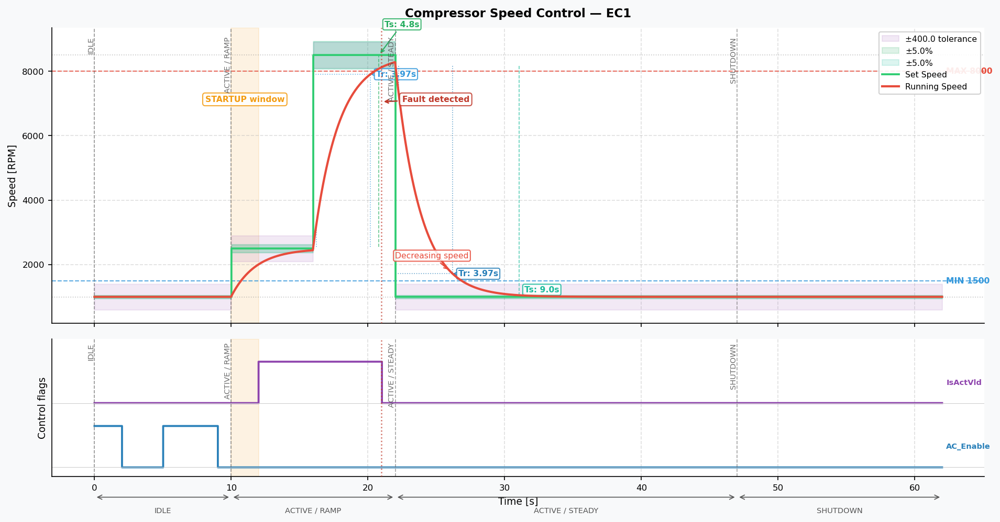

**Real log via YAML:**


---

## 9. Real compressor log — Python API

**Source:** [examples/ex_real_log_analysis.py](../examples/ex_real_log_analysis.py)

Full phase-first workflow on a real hardware log: six named phases defined
upfront, startup transient analysis referenced by phase object, tracking
error subplot, digital flag lanes.


---

## 10. Batch processing — multiple logs, one template

**Source:** [examples/ex_multi_log_analysis.py](../examples/ex_multi_log_analysis.py)  
**Template:** [examples/compressor_analysis_template.yaml](../examples/compressor_analysis_template.yaml)

One shared YAML template defines signal names, analysis config, and layout.
Per-run Python code supplies a pre-loaded DataFrame (`data=`) and phase
annotations (`overrides=`). The same template renders any number of logs.

**Run 001** (startup at t = 14 s):

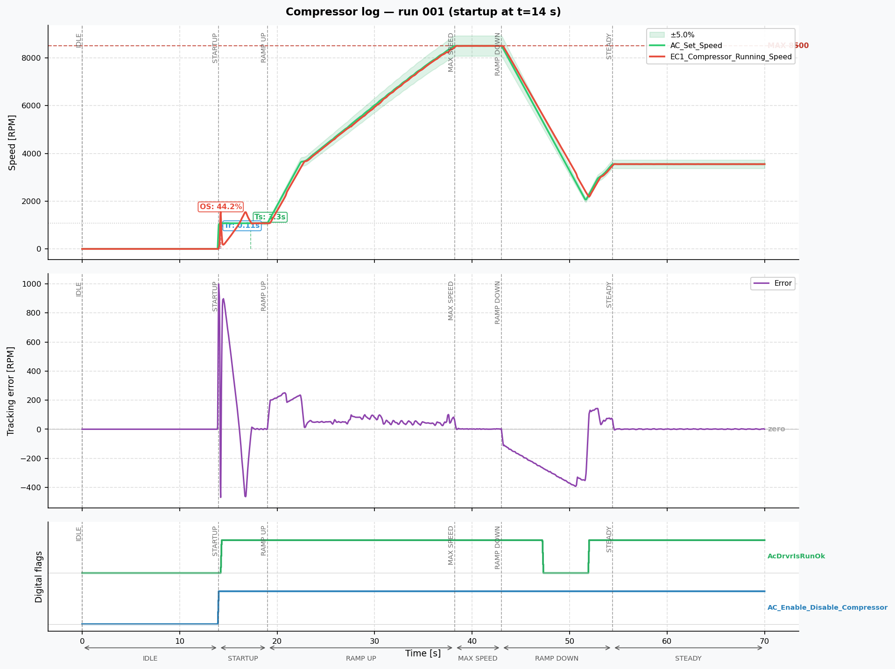

**Run 002** (oscillations at steady state):

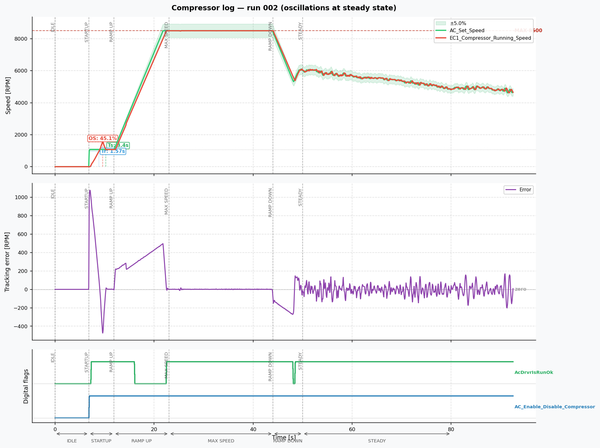
